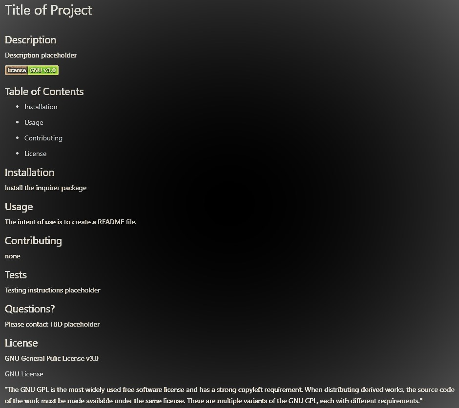

# README Generator

## Description 
 Using starter code provided by the boot camp, this app will generate high-quality README files by using the command line within a CLI such as VS Code. The user will input information and the 'Inquirer package' will be used to dynamically create the README.
 
A walkthrough of the CLI application where a README file is generated can be found here: [README Generator](https://drive.google.com/file/d/1opJn6V07_wkamW1GzAS53-ML9RcjetLy/view)

 ## Table of Contents 
 
 * [Installation](#installation) 
 
 * [Usage](#usage) 
 
 * [Contributing](#contributing) 
 
 ## Installation 
 1. Install the package-lock.json by typing `npm init -y`
 2. Install the inquirer package by typing `npm i inquirer@8.2.4` in the terminal 
 
 ## Usage 
 The intent of use is to create a README file. 

A high-quality README will consist of the following:
- Title of project
- Description
- Table of contents
- Installation
- Usage
- License
- Contributing
- Tests 
- Questions

For example:

 
 ## Contributing 
[Katie Vlasic](https://github.com/katievlasic)